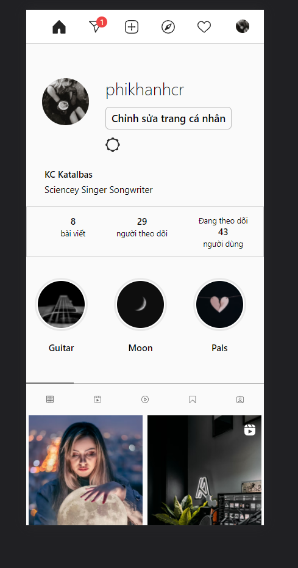

# Front-end for Instagram clone
> A website that is familiar to you, 
> The Social Media Web 
> The Ui is being built by using TailwindCss
> You can upload your images like Instagram using ReactJs and Cloudinary for storing images
> Comment on post realtime using Socket.Io Client
## Installation
```bash
git clone https://github.com/phikhanhcr/Instagram2022.git
```
## Usage
```python
npm install 
npm start
```
## Start TailwindCss
```python
 npx tailwindcss-cli build -i src/assert/tailwind/base/tailwind.css -o src/assert/tailwind/build/styleTailwind.css --watch
```
## Contributing
Pull requests are welcome. For major changes, please open an issue first to discuss what you would like to change.
Please make sure to update tests as appropriate.

### Some images from this app 
#### Homepage


#### Profile
\

#### Discover


#### Notification Realtime


#### Feature upload images


#### Full Responsive



### Q&A
If you have any questions, please don't be hesitate to contact me by email
```python
sykhanhsky@gmail.com
```
Thank you!!!